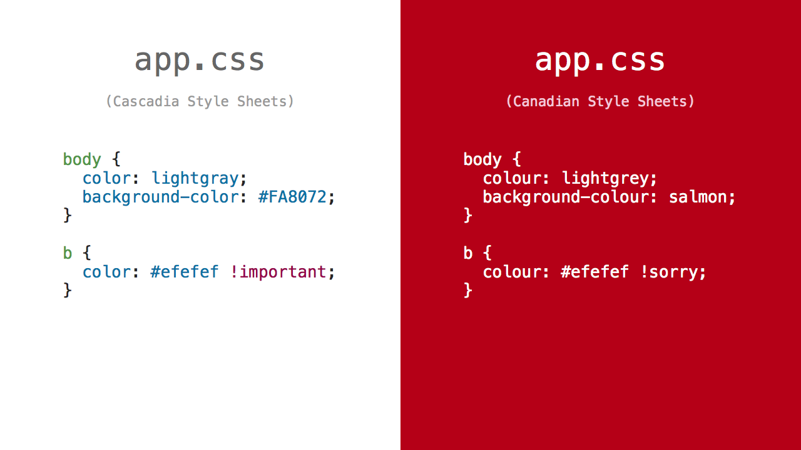

# PostCSS Canadian Stylesheets [](https://travis-ci.org/chancancode/postcss-canadian-stylesheets)

[PostCSS] plugin for writing Canadian stylesheets.

[PostCSS]: https://github.com/postcss/postcss



## Usage

```js
postcss([ require('postcss-canadian-stylesheets') ])
```

## Ember CLI

For Ember CLI applications, see [ember-cli-canadian-stylesheets](https://github.com/chancancode/ember-cli-canadian-stylesheets).

See [PostCSS] docs for examples for your environment.
